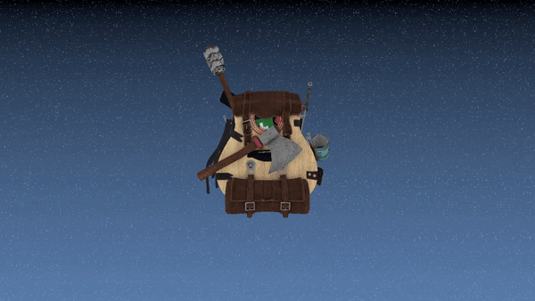

# vulkaning

A Vulkan renderer I use to learn graphics programming

## Crates

- [`ash`](https://github.com/ash-rs/ash) for Vulkan bindings
- [`winit`](https://github.com/rust-windowing/winit) for windowing
- [`bevy`](https://github.com/bevyengine/bevy) for ECS and asset management

## Tools

- `cargo`
- `cargo-make`

## Getting started

- `cargo make run`
